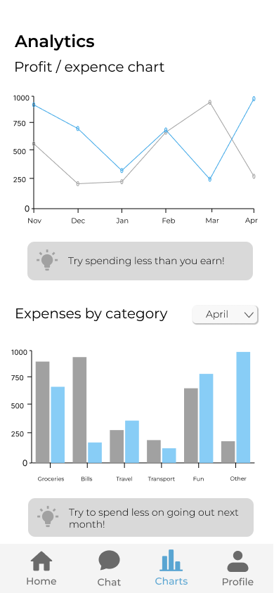

# SmartSpend - Financial Advisor App

SmartSpend is an innovative financial advisor application developed during the Eestech Challenge Hackathon, a 24-hour event focused on creating unique business ideas. The key challenge was to create an application that leverages Large Language Models (LLMs) for educational purposes.

## About the App
SmartSpend helps you manage your finances by allowing you to enter your income, expenses, and financial goals. The app provides personalized tips and advice for better spending and saving money. Additionally, SmartSpend includes an integrated chat feature where you can ask questions to an LLM-powered assistant for financial guidance.

SmartSpend also offers graphical representations of your spending habits, making it easier to visualize where your money goes. The LLM is capable of categorizing your expenses based on the names you enter, providing a clearer picture of your financial activities. The app's design is modern and functional, ensuring a seamless and intuitive user experience.

<iframe src="images/demo" frameborder="0" allowfullscreen></iframe>

## Features
- **Income and Expense Tracking**: Log your financial data, including income, expenses, and financial goals.
- **Personalized Financial Advice**: Receive customized tips and suggestions on how to optimize your spending and saving habits.
- **LLM-Powered Chat**: Ask questions about finance, budgeting, and more, and get intelligent responses from a Large Language Model.
- **Spending Habit Visualization**: View graphs that showcase your spending habits, helping you understand your financial patterns.
- **Automated Expense Categorization**: The LLM categorizes your expenses based on the names you enter, making it easier to manage your budget.
- **Goal Tracking**: Define your financial goals and get feedback on your progress toward achieving them.

  
  

## How to Use
1. **Define Your Goals**: Set your short-term and long-term financial goals.
2. **Start Getting Advice**: Use the chat feature to ask the LLM-powered assistant for tips on budgeting, saving, or general financial advice.
3. **Visualize Your Spending**: View the graphs to understand your spending habits and how they change over time.
4. **Track Your Progress**: Monitor your income, expenses, and goals to see how you're improving.

  
  

## Important Notes
SmartSpend was developed during a 24-hour hackathon, so some features may not be fully completed. However, all key features are functional.

## Backend and Frontend
- The backend of SmartSpend is written in Python and uses the Llama 2 Large Language Model. During development, it was running on AWS EC2 instances, but it can also be configured to run locally. This flexibility allows you to experiment with different setups, depending on your resources and needs.
- The frontend is developed using Android Studio with Java, designed to be modern and functional, and providing a seamless user experience.

## Future Plans
In the future, we aim to discuss with banks to see if they would like to integrate SmartSpend into their mobile banking applications. This would allow users to benefit from SmartSpend's features directly within their banking apps.

## Authors

- Olivera Radovanović - [GitHub](https://github.com/Olivera2708)
- Mila Milović - [GitHub](https://github.com/milamilovic)
- Miloš Bojanić - [GitHub](https://github.com/milosbojanic)

---

We hope you find SmartSpend helpful on your financial journey. If you have any questions or feedback, please let us know.
